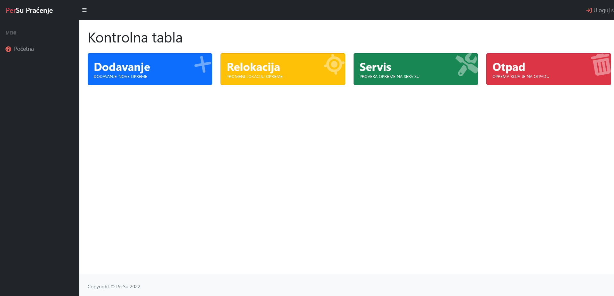
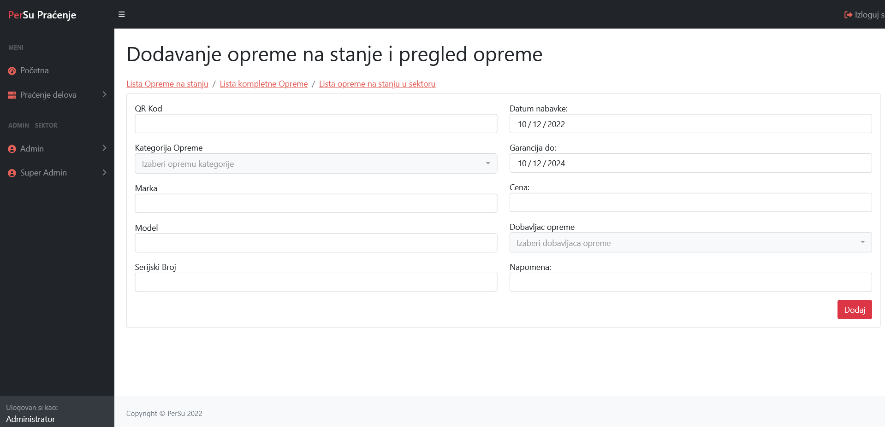

# BBTracking aplication - _application written in C#_
_Application contains Login System, Add Equipment to the balance, Relocation Equipment, Putting equipment into service, List of all Equipments, Printing to PDF, Admin Role (Add User,Add Supplier, Add Servicer, Add Categories & List of All), Super Admin Role (Add User,Add Supplier, Add Servicer, Add Categories, Add Market, Add Sector, Chnage User, Printing All & List of All), and many more actions._
> ## Login Page

> ## Home Page

> ## Add Equipment

> ## Relocation Equipment

> ## Add User

